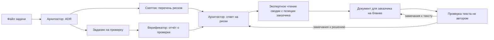

# Шаблоны документов

Шаблон появляется здесь, только если документ уже требуется процессом или обещан заказчику. Это тот же принцип, что с ролями: заготовок «на всякий случай» нет.

## Для заказчика

Оформляются на бланке: правила — [client-document.md](client-document.md), файл Word — [DoverAI_blank.dotx](DoverAI_blank.dotx).

| Шаблон | Фаза | Зачем |
|---|---|---|
| [vision-and-hypotheses.md](vision-and-hypotheses.md) | 0. Квалификация | Наше видение задачи, гипотезы и вопросы к ним. Приложение «Итог разговора» — артефакт фазы |
| [survey-report.md](survey-report.md) | 1. Обследование | Спецификация с границами, риски, план, фиксированная цена, место размещения кода |
| [expert-meeting.md](expert-meeting.md) | 1. Обследование и далее | Встреча с экспертом заказчика: вопросы с гипотезами письменно заранее, «хороший ответ» и «насторожит», репетиция, протокол |
| [change-request.md](change-request.md) | 3. Сборка | Всё, что выходит за границы спецификации: оценивается отдельно, исходная цена не меняется |
| [audit-report.md](audit-report.md) | Приёмка кода | Отчёт по маршруту [AUDIT.md](../AUDIT.md) |

## Контракты вывода ролей

Структура результата, который читает следующая роль. Соблюдается дословно: пропуск раздела должен быть заметен.

| Шаблон | Кто заполняет | Кто читает |
|---|---|---|
| [task.md](task.md) | Тот, кто ведёт задачу; роли дописывают журнал | Все роли, кроме верификатора |
| [adr.md](adr.md) | [Архитектор](../roles/architect.md) | Скептик, команда, заказчик |
| [risk-register.md](risk-register.md) | [Скептик](../roles/skeptic.md); раздел ответа — архитектор | Архитектор, заказчик |
| [verification-request.md](verification-request.md) | Тот, кто выдвинул утверждения | [Верификатор](../roles/verifier.md) — и только он |

## Сборка документа на бланке

Документ для заказчика пишется в Markdown по шаблону и собирается в Word через pandoc с бланком [DoverAI_blank.docx](DoverAI_blank.docx) в роли эталона стилей. Скрипты сборки — сам перевод в Word и PDF, рисование схем в стиле бланка, пересборка бланка — входят во внутренний инструментарий студии и здесь не публикуются.

Выноски размечаются блоками: `::: {custom-style="Гипотеза"}` … `:::`. Есть также стили «Решение за вами», «Риск» и «Реквизиты».

На схемах уже существующее у заказчика показывается синим, новое — зелёным, внешние системы — серым пунктиром.

## Как связаны

Рекомендации в документе — только из решения архитектора. Утверждения того, кто ведёт задачу, проверяются верификатором наравне с утверждениями ролей.
